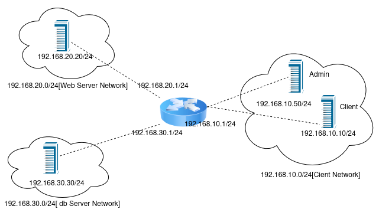
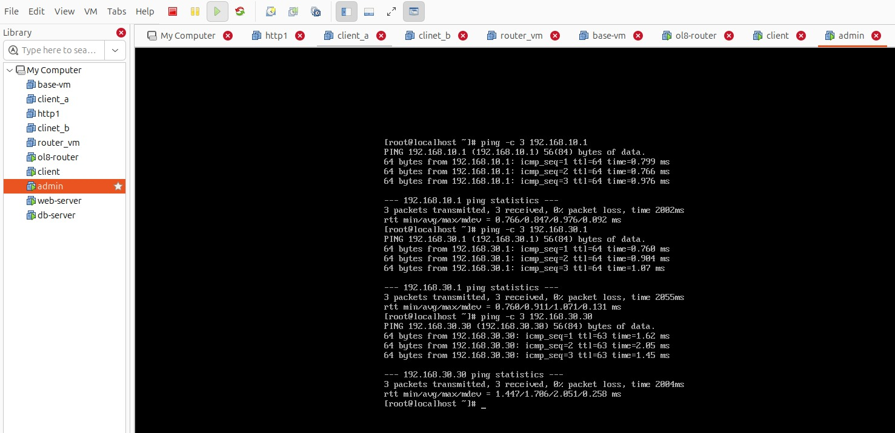
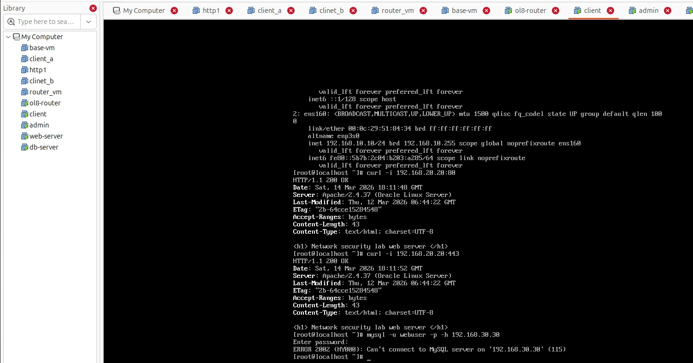
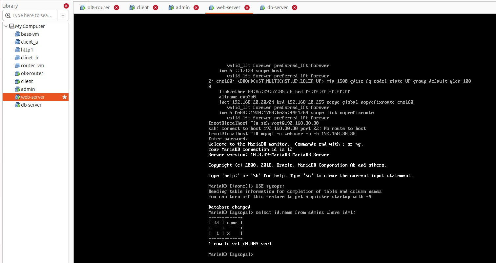
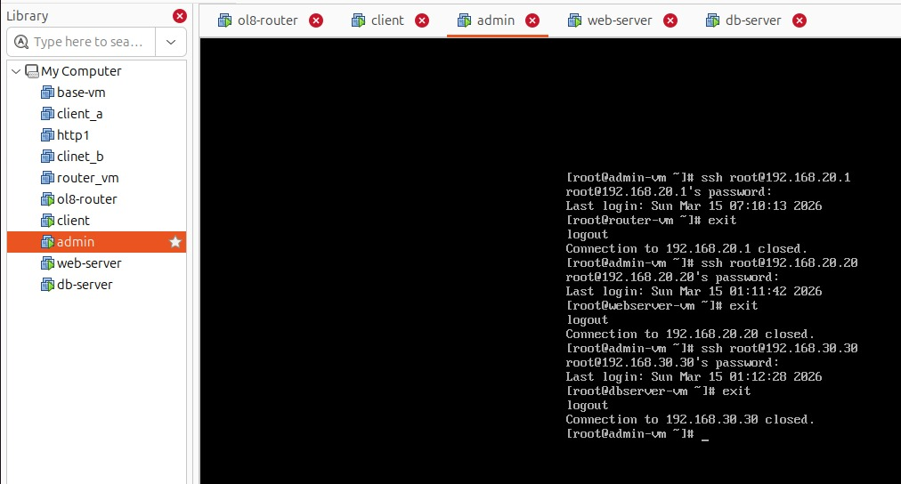

# Network Segmentation and firewall security policy



# Use of VMware work stations Virtual Network Editor, nmcli tool and firewall-cmd client

## Subnet Creation

>> Go to Virtual Network Editor from Edit tab -> Select Add Network -> Select Host Only radio button -> Deselect all other options -> fill-up subnet and subnet mask -> give a MTU value

- vmnet2 - subnet: 192.168.10.0 ; mask: 255.255.255.0; mtu: 1500
- vmnet3 - subnet: 192.168.20.0 ; mask: 255.255.255.0; mtu: 1500
- vmnet4 - subnet: 192.168.30.0 ; mask: 255.255.255.0; mtu: 1500

## Create 5 Vms in VMware Workstation
* Create:
- Router VM using 3 custom Network Interface(vmnet2,vmnet3,vmnet4)
- client and admin VM using vmnet2
- web-server vm using vmnet3
- db-server vm using vmnet4


## Manual IP assigning using `nmcli` command

-Router VM

```
#nmcli con add con-name eth0 type ethernet ifname ens160 ipv4.method manual ipv4.addresses 192.168.10.1/24
#nmcli con add con-name eth1 type ethernet ifname ens224 ipv4.method manual ipv4.addresses 192.168.20.1/24
#nmcli con add con-name eth2 type ethernet ifname ens256 ipv4.method manual ipv4.addresses 192.168.30.1/24
```
>> Activate the Interfaces

```
#nmcli con up eth0
#nmcli con up eth1
#nmcli con up eth2
```
- client vm

```
#nmcli con add con-name eth0 type ethernet ifname ens160 ipv4.method manual ipv4.addresses 192.168.10.10/24 ipv4.gateway 192.168.0.1

#nmcli con up eth0
```

- admin vm

```
#nmcli con add con-name eth0 type ethernet ifname ens160 ipv4.method manual ipv4.addresses 192.168.10.50/24 ipv4.gateway 192.168.10.1

#nmcli con up eth0
```

- web-server

```
#nmcli con add con-name eth1 type ethernet ifname ens160 ipv4.method manual ipv4.addresses 192.168.20.20/24 ipv4.gateway 192.168.20.1

#nmcli con up eth1
```

- db-server

```
#nmcli con add con-name eth2 type ethernet ifname ens160 ipv4.method manual ipv4.addresses 192.168.30.30/24 ipv4.gateway 192.168.30.1

#nmcli con up eth2
```

## Packet forwarding through kernel in different subnet

```
#sysctl -w net.ipv4.ip_forward=1
```
>> For persistence add `net.ipv4.ip_forward=1` to /etc/sysctl.d/99-ip-forward.conf

```
#sysctl -p /etc/sysctl.d/99-ip-forward.conf
```

## Check Network Connectivity using `ping` 

>> From admin vm 

```
#ping -c 3 192.168.10.1

#ping -c 3 192.168.30.1

#ping -c 3 192.168.30.30
```


## Web server and DB server setup

>> Temporarily add a NAT network adapter to access internet

- install httpd & mariadb[for-client-access]on web-server
```
#dnf install httpd -y

#systemctl enable httpd

#systemctl start httpd

#echo "<h1>Network security lab</h1>" > /var/www/html/index.html

#dnf install mariadb -y

```

- install and configure mariadb on db-server
```
#dnf install mariadb-server -y

#systemctl enable mariadb
#systemctl start mariadb
```
>> setup
```
#mysql_secure_installation
#mysql -u root -p
(mariadb)CREATE DATABASE sysops;
(mariadb)CREATE USER 'webuser'@'192.168.20.20' IDENTIFIED BY 'password';
(mariadb)GRANT ALL PRIVILEGES ON sysops.* TO 'webuser'@'192.168.20.20';
(maraidb)FLUSH PRIVILEGES;
(mariadb)EXIT;
```

## Firewall Implementation

- On web-server
    - allow http,https access for all
    - allow ssh access only for admin

>> remove existing services if any `firewall-cmd --permanent --remove-service=[service-name]`

```
#firewall-cmd --permanent --zone=public --add-service=http --add-service=https

#firewall-cmd --permanent --zone=public --add-rich-rule='rule family="ipv4" source address="192.168.10.50" service name="ssh" accept'

#firewall-cmd --reload

```

- On db-server
    - allow ssh access only for admin
    - allow db access only for web

```
#firewall-cmd --permanent --zone=public --add-rich-rule='rule family="ipv4" source address="192.168.10.50" service name="ssh" accept'

#firewall-cmd --permanent --zone=public --add-rich-rule='rule family="ipv4" source address="192.168.20.20" port port="3306" protocol="tcp" accept'

#firewall-cmd --reload
```

- On router vm [to-pass-traffic-across-interfaces]

```
#firewall-cmd --permanent --zone=public --add-forward 

#firewall-cmd --reload
```

## Check firewall security policy

- From client vm
```
#curl -i 192.168.20.20:80
#curl -i 192.168.20.20:443

#mysql -u webuser -p -h 192.168.30.30
```



- From web server

```
#ssh root@192.168.30.30

#mysql -u webuser -p -h 192.168.30.30

```


- From admin workstation

```
[router-vm]
#ssh root@192.168.20.1

[web-server]
#ssh root@192.168.20.20

[db-server]
#ssh root@192.168.30.30
```

